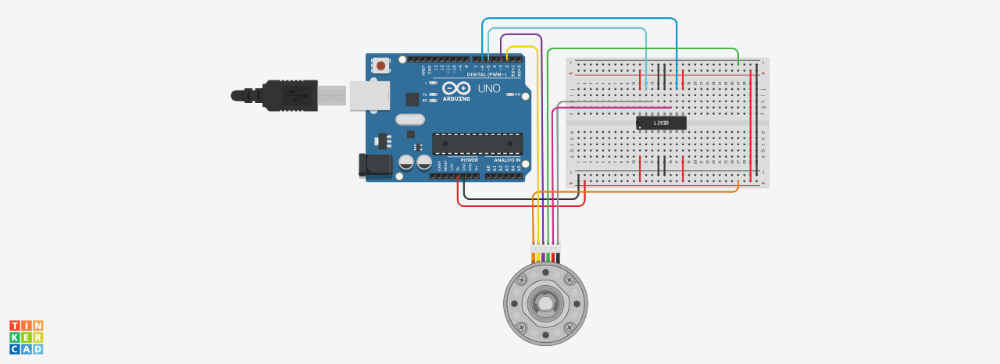

# Task4_Electronics_and_electrical_engineering
## **Description**

In this task, a motor with encoder will be started and controlled, so that it stops when the value in the encoder is greater than 3000.

## **Circuit**

In these circuit we use these components:
1. 1 Arduino board
1. 1 Breadboard 
1. 1 DC motor with encoder
1. 1 H-bridge motor driver
1. Normal wires

